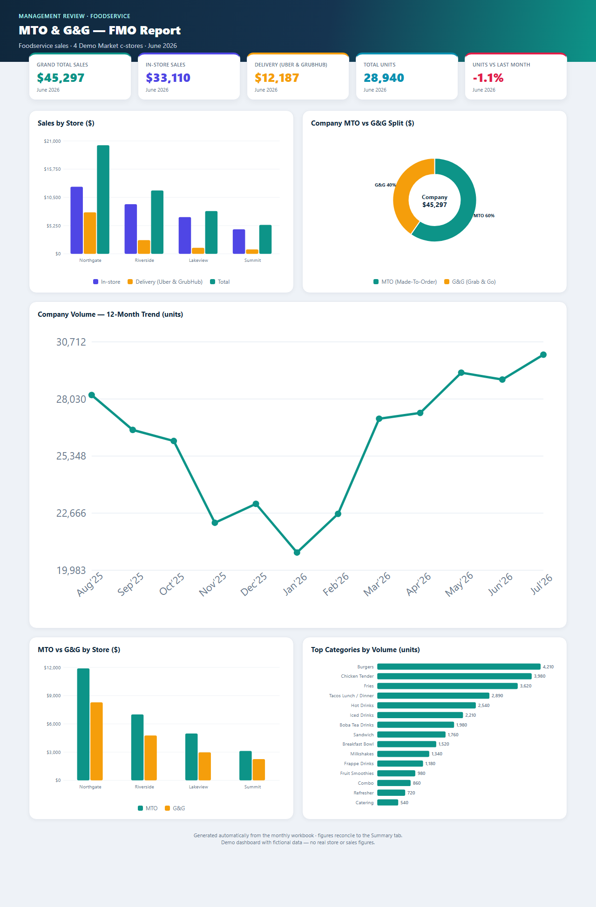

# MTO &amp; G&amp;G — Monthly Foodservice Report Automation

Python automation that turns a raw point-of-sale **"Product Group Ranking"** export
into a fully-built monthly **MTO &amp; G&amp;G – FMO** foodservice report — Excel workbook
**and** a standalone HTML dashboard — in one command.

It replaces a multi-hour manual Excel process (unmerge → split per store → VLOOKUP
sales → add new items → roll the 12-month trend → refresh the No-Movement tab) with a
repeatable, near-zero-touch run.

> **Live demo dashboard:** https://mto-gg-dashboard.vercel.app
>
> This repository is a **sanitized public demo**. All store names, brands and figures
> are fictional ("Demo Market"; stores Northgate / Riverside / Lakeview / Summit). The
> automation logic is the real thing; the sample data is not.

---

## What it does

- **Auto-detects inputs** — finds the newest `*Product Group Ranking*.xlsx`, derives the
  new month, output filename and dashboard title from the template's trend header (so the
  only thing to maintain is the template + dropping in the ranking file).
- **Rebuilds the 4 store tabs** — unmerges and re-splits each store's category data, then
  adds a bold TOTAL row (Qty + $) at the foot of every store sheet.
- **Computes the Summary** — VLOOKUP-driven sales by store and category, with automatic
  status reconciliation to the grand total.
- **Rolls the 12-month trend** — shift-and-freeze window: slide left, freeze last month's
  value, keep the live formula for the new month; idempotent (skips if already rolled).
- **Inserts new items hands-off** — via Excel COM so Excel itself expands the category
  subtotals and repairs the structured table + reconciliation references (see *Design notes*).
- **Restyles the Summary charts** — preserves the original chart look (titles + plot fills
  that `openpyxl` drops on save are restored, not rebuilt).
- **Emits a standalone HTML dashboard** — self-contained inline-SVG (KPI tiles, sales by
  store, 12-month volume trend, MTO vs G&amp;G split, category volume). Offline &amp; emailable.

## The dashboard

The `demo/` folder contains a self-contained `index.html` — no build step, no external
requests. Open it in a browser or deploy the folder to any static host.



## Tech

| | |
|---|---|
| Language | Python 3.11 |
| Excel I/O | `openpyxl` |
| Hands-off insert / recalc | `pywin32` (Excel COM) — Windows + Excel only |
| Dashboard | Vanilla HTML + inline SVG (no dependencies) |

## Usage

```bash
pip install openpyxl pywin32
# 1) put last month's finished workbook + the new Product Group Ranking export in the folder
# 2) point TEMPLATE_FILE (top of automation/update_report.py) at last month's workbook
python automation/update_report.py
```

Or double-click `automation/run_report.bat` on Windows.

## Design notes

- **The Summary sheet is two tables sharing row numbers** — an item block (`A:P`) and a
  side-by-side trend table (`R:AE`). Any row insert must be `A:P`-only, or the trend table
  is corrupted.
- **`openpyxl` and charts** — on save it preserves a chart's area fill and series, but drops
  cell-linked titles and the plot-area fill. The script restores just those two, rather than
  rebuilding charts (which would lose the original styling).
- **Why Excel COM for inserts** — inserting an item inside a category requires Excel to
  auto-expand the subtotal `SUM` and repair the structured Table + reconciliation formulas
  (which reference rows by absolute number). `openpyxl` can't do that safely, so Excel does it.

## License

[MIT](LICENSE)
